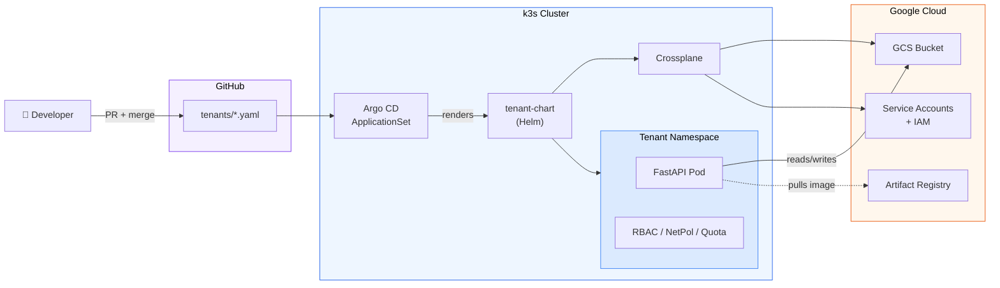

# platform-gitops

A self-service platform on a self-hosted Kubernetes cluster. A developer onboards by opening a single pull request; the platform then provisions an isolated tenant in its own namespace, a cloud storage bucket, scoped cloud identities, and a running frontend that reads and writes that bucket.

It runs entirely on a local **k3s** cluster and provisions real **Google Cloud Storage** buckets through **Crossplane**, driven by **Argo CD**.

---

## What a tenant gets from one file

Adding `tenants/<name>.yaml` and merging it produces, automatically:

- A dedicated **namespace**
- A **GCS bucket** (via Crossplane)
- Two decoupled **GCP service accounts** — one for bucket access, one for image pulls — each with least-privilege IAM
- A **FastAPI app** that lists, uploads, downloads, and deletes objects in that bucket (`/docs` can be used as the UI)
- **RBAC**, **NetworkPolicy**, and **ResourceQuota/LimitRange** scoped to the namespace

---

## Architecture



**Flow:** the Argo CD `ApplicationSet` uses a **git file generator** to watch `tenants/*.yaml`. Each file becomes one Argo CD `Application`, which renders the shared `tenant-chart` Helm chart with that tenant's values. The chart emits both Kubernetes objects (Deployment, RBAC, etc.) and Crossplane managed resources (Bucket, ServiceAccount, IAM). Crossplane reconciles those against GCP and writes the generated SA key back into the tenant namespace as a Secret, which the app mounts.

---

## Repository layout

```
platform-gitops/
├── platform/                       # Cluster-level, applied once by hand
│   ├── argocd/
│   │   └── applicationset.yaml     # The self-service engine: 1 tenant file → 1 Application
│   └── crossplane/
│       ├── gcp-cloudplatform-provider.yaml   # Crossplane provider: IAM, service accounts
│       ├── gcp-storage-provider.yaml         # Crossplane provider: GCS buckets + bucket IAM
│       ├── providerconfig-gcp.yaml           # Points Crossplane at the GCP project + creds Secret
│       └── mrap.yaml                         # ManagedResourceActivationPolicy: which MRs are active
│
├── tenant-chart/                   # Shared Helm chart — one chart for ALL tenants
│   ├── Chart.yaml
│   ├── values.yaml                 # Defaults (project, quota sizes, resources, service type)
│   └── templates/
│       ├── namespace.yaml
│       ├── bucket.yaml             # Crossplane Bucket (GCS)
│       ├── gcp-sa.yaml             # 2 SAs + keys + bucket IAM + Artifact Registry IAM
│       ├── deployment.yaml         # FastAPI app, hardened pod, mounts the GCP creds
│       ├── service.yaml            # NodePort exposing the app
│       ├── serviceaccount.yaml     # K8s SA the pod runs as
│       ├── rbac.yaml               # Namespace-scoped Role + RoleBinding for the tenant dev
│       ├── networkpolicy.yaml      # Default-deny cross-namespace ingress/egress
│       └── quota.yaml              # ResourceQuota / LimitRange
│
├── tenants/                        # The developer-facing surface — one file per tenant
│   └── tenant-abc.yaml
│
└── demo_frontend/                  # The application image source
    ├── main.py                     # FastAPI: list / upload / download / delete + /healthz
    ├── Dockerfile                  # python:3.14-slim, non-root user
    └── requirements.txt
```

---

## The tenant contract

A tenant is described entirely by one file in `tenants/`. Example — `tenants/tenant-abc.yaml`:

```yaml
tenantName: tenant-abc
bucketName: tenant-abc-bucket-testdemo543   # must be globally unique in GCS
gcpProject: kubernetes-object-store
bucketLocation: EU
image:
  repository: europe-west1-docker.pkg.dev/kubernetes-object-store/demo-frontend/bucket-api
  tag: latest
description: "Tenant ABC - demo tenant"
```

| Field | Required | Notes |
|-------|----------|-------|
| `tenantName` | yes | Becomes the namespace, release name, and Argo CD Application name. Keep it DNS-safe. |
| `bucketName` | yes | GCS bucket names are **globally unique** — suffix it to avoid collisions. |
| `gcpProject` | yes | The GCP project buckets and IAM land in. |
| `bucketLocation` | yes | GCS location, e.g. `EU`, `US`, `europe-west1`. |
| `image.repository` / `image.tag` | yes | The app image in Artifact Registry. |
| `description` | no | Human-readable label; not consumed by the chart. |

> The `ApplicationSet` runs Go templating with `missingkey=error`, so **every field referenced by the template must be present** in the tenant file, or the Application fails to render. This is deliberate — it fails loudly at PR time instead of producing a half-configured tenant.

---

## Prerequisites

- 3 Linux VMs (reference setup: **Debian Bookworm** on OrbStack) — one k3s server, two agents. Any cluster works, but the setup steps below assume this layout.
- `kubectl` and `helm` on your workstation
- A GCP project with the **Cloud Storage** and **IAM/Service Account** APIs enabled
- A GCP service account JSON key for Crossplane, with permission to create buckets, service accounts, and IAM bindings (Storage Admin, plus Service Account Admin + Project IAM Admin for the per-tenant identities this chart creates)

Argo CD and Crossplane are installed as part of the setup below.

---

## Cluster setup (operator, once)

The reference environment is a 3-node **k3s** cluster running on **Debian Bookworm** VMs (OrbStack on macOS). One server node and two agents.

| VM | Role | Memory |
|----|------|--------|
| `k3s-server` | control plane + server | — |
| `k3s-node-1` | agent | 1 GB |
| `k3s-node-2` | agent | 2 GB |

**1. Install k3s on the server node:**

```bash
curl -sfL https://get.k3s.io | sh -
```

**2. Get the join token from the server** (needed to add agents):

```bash
sudo cat /var/lib/rancher/k3s/server/node-token
```

**3. Join `k3s-node-1` and `k3s-node-2` to the cluster.** Run on each agent, using the server's address and the token from the previous step:

```bash
curl -sfL https://get.k3s.io | \
  K3S_URL=https://k3s-server.orb.local:6443 \
  K3S_TOKEN=K10f... \
  sh -
```

> The `:6443` port on `K3S_URL` is required — the agent connects to the server's Kubernetes API, not port 80/443.

Verify all three nodes are `Ready`:

```bash
kubectl get nodes
```

**4. Install Argo CD:**

```bash
kubectl create namespace argocd
kubectl apply -n argocd --server-side --force-conflicts \
  -f https://raw.githubusercontent.com/argoproj/argo-cd/stable/manifests/install.yaml
```

Then log in, change the admin password, and remove the initial password secret:

```bash
# initial password
kubectl -n argocd get secret argocd-initial-admin-secret \
  -o jsonpath="{.data.password}" | base64 -d; echo
# ...log in via UI/CLI, change the password, then:
kubectl -n argocd delete secret argocd-initial-admin-secret
```

**5. Install Crossplane via Helm:**

```bash
helm repo add crossplane-stable https://charts.crossplane.io/stable
helm repo update
helm install crossplane crossplane-stable/crossplane \
  --namespace crossplane-system --create-namespace
```

**6. Prepare GCP for the Crossplane GCS provider:**

1. Create a **GCP project** (this repo uses `kubernetes-object-store`).
2. Create a **service account** for Crossplane with the **Storage Admin**, **IAM Admin**, **Project IAM Admin** roles.
3. **Generate a JSON key** for that service account.

---

## Platform bootstrap (operator, once)

With the cluster, Argo CD, and Crossplane in place, wire the platform up.

**1. Give Crossplane its GCP credentials.** Save the service account key as a Secret named `gcp-creds` (key `creds`) in `crossplane-system` — this is what the `ProviderConfig` reads:

```bash
kubectl create secret generic gcp-creds \
  -n crossplane-system \
  --from-file=creds=./creds.json
```

**2. Install the Crossplane providers, config, and activation policy:**

```bash
kubectl apply -f platform/crossplane/gcp-cloudplatform-provider.yaml
kubectl apply -f platform/crossplane/gcp-storage-provider.yaml
# wait for both providers to report INSTALLED=True HEALTHY=True
kubectl get providers

kubectl apply -f platform/crossplane/providerconfig-gcp.yaml
kubectl apply -f platform/crossplane/mrap.yaml
```

> `mrap.yaml` is a `ManagedResourceActivationPolicy` — it explicitly activates only the managed resources the platform uses (buckets, bucket IAM, service accounts, SA keys, project IAM). This keeps the surface tight and CRDs predictable.

**3. Install the self-service ApplicationSet:**

```bash
kubectl apply -f platform/argocd/applicationset.yaml
```

From here on, the platform is live: any tenant file merged to `main` becomes a running tenant.

---

## Onboarding a tenant (developer)

1. Copy an existing file in `tenants/` to `tenants/<your-tenant>.yaml` and edit the values.
2. Open a pull request. (In production this is where review, policy checks, and approvals live.)
3. Merge it.
4. Argo CD detects the new file, creates an `Application`, and syncs. Watch it:

```bash
kubectl get applications -n argocd
kubectl get bucket,pods -n <your-tenant> -w
```

5. Once the bucket is `READY=True` and the pod is `Running`, reach the app. With `service.type: NodePort`:

```bash
kubectl get svc -n <your-tenant>
# open the NodePort, then browse to /docs
```

Use `/docs` (Swagger UI) to upload, list, download, and delete objects in the tenant's bucket.

**Offboarding:** delete the tenant's file and merge. Argo CD prunes the Application (`prune: true`), which removes the namespace and — because they're Crossplane managed resources — the bucket, IAM bindings, and service accounts too.

> Bucket deletion follows Crossplane's deletion policy. Confirm whether you want `Delete` (removes cloud data) or `Orphan` (keeps the bucket) before offboarding anything with real data.

---

## The application (`demo_frontend`)

A small **FastAPI** service that talks to one bucket, named by the `BUCKET_NAME` env var. The GCS client picks up credentials from `GOOGLE_APPLICATION_CREDENTIALS`.

| Method | Path | Purpose |
|--------|------|---------|
| `GET` | `/files` | List objects (name, size, updated, content type) |
| `POST` | `/files/{filename}` | Upload a file |
| `GET` | `/files/{filename}` | Download a file (streamed) |
| `DELETE` | `/files/{filename}` | Delete a file |
| `GET` | `/healthz` | Health check |
| `GET` | `/docs` | Swagger UI — the demo's frontend |

Build and push:

```bash
cd demo_frontend
docker build -t europe-west1-docker.pkg.dev/<project>/demo-frontend/bucket-api:latest .
docker push  europe-west1-docker.pkg.dev/<project>/demo-frontend/bucket-api:latest
```

The image runs as a non-root user (UID 1000) and, in the cluster, with a read-only root filesystem.

---

## Multi-tenancy & isolation

Isolation is enforced by the infrastructure:

- **Namespace per tenant** — the hard boundary everything else hangs off.
- **RBAC** (`rbac.yaml`) — a `tenant-<name>-dev` user gets a namespace-scoped read Role only; they can inspect their own workloads and nothing else.
- **NetworkPolicy** (`networkpolicy.yaml`) — default-deny. Pods may only talk to pods in the same namespace, plus egress on 443 (GCS/Artifact Registry) and 53 (DNS). No cross-namespace pod traffic.
- **ResourceQuota / LimitRange** (`quota.yaml`) — caps CPU, memory, and pod count so one tenant can't starve the cluster.
- **Scoped cloud identity** — the app's GCP service account holds `roles/storage.objectUser` on **its bucket only** (`BucketIAMMember`), not project-wide storage access.

---

## Security & least privilege

- **Decoupled identities.** Bucket access and image pulls use **separate** service accounts (`<tenant>-app-sa` and `<tenant>-gar-sa`), each with only the role it needs — `roles/storage.objectUser` on the one bucket, `roles/artifactregistry.reader` for pulls. A compromise of one doesn't grant the other.
- **Pod hardening.** `runAsNonRoot`, `runAsUser: 1000`, `allowPrivilegeEscalation: false`, `readOnlyRootFilesystem: true`, and `automountServiceAccountToken: false`.
- **Credential handling.** Crossplane generates the SA key and writes it into the tenant namespace; the pod mounts it read-only at `/var/run/gcp/creds.json`. The Crossplane bootstrap key is a manually created Secret and is **not** committed to Git.

### Known demo-vs-production tradeoffs

- **Static SA keys** are used for simplicity. Production should use **Workload Identity Federation** — no long-lived keys.
- Generated Secrets live in-cluster. Production should deliver them via **External Secrets Operator** backed by a secret manager.
- Artifact Registry read is granted **project-wide** (`ProjectIAMMember`). Production should scope it to the **repository** (`provider-gcp-artifact` / repository-level IAM).

---

## Tech stack

| Concern | Choice | Why |
|---------|--------|-----|
| Cluster | k3s (on OrbStack VMs) | Self-hosted, multi-node, runs locally |
| GitOps / CD | Argo CD + ApplicationSet | Git is the source of truth; onboarding is a PR |
| Infra provisioning | Crossplane (GCP providers) | Cluster-native, continuously reconciled, no separate state file |
| Object storage | Google Cloud Storage | Cloud dependency; free tier |
| Registry | GCP Artifact Registry | Same cloud, private image hosting |
| App | FastAPI (Python) | Minimal, self-documenting via `/docs` |

---

## Troubleshooting

- **`ImagePullBackOff` (401/403 from `*-docker.pkg.dev`)** — the pull identity lacks `roles/artifactregistry.reader`, or the pull Secret is missing/mistyped. Confirm the `<tenant>-gar-sa` IAM binding reconciled and that the image path matches the registry host exactly.
  - To create the GAR pull secret run the following:
```
kubectl -n <tenant-name> create secret docker-registry <tenant-name>-gar-pull
    --docker-server=europe-west1-docker.pkg.dev
    --docker-username=_json_key
    --docker-password="$(
    kubectl -n <tenant-name> get secret <tenant-name>-gar-sa \
      -o jsonpath='{.data.private_key}' | base64 -d
  )"   --docker-email=unused@example.com
```

- **Application won't render / `missingkey` error** — the tenant file is missing a field the ApplicationSet template references. Add the field; every key in the template is required.
- **App gets GCP auth errors** — verify the mounted `/var/run/gcp/creds.json` is valid JSON and that the `<tenant>-gcp-sa` connection Secret was written into the tenant namespace by Crossplane.
